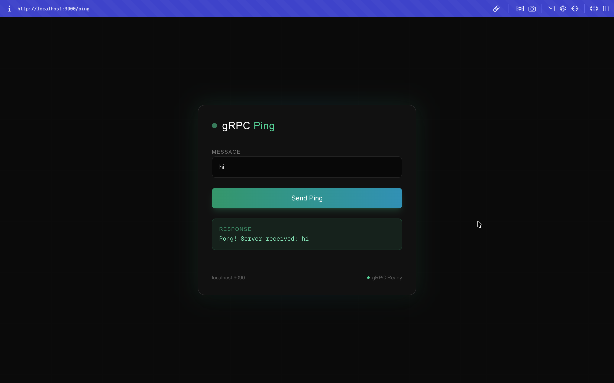
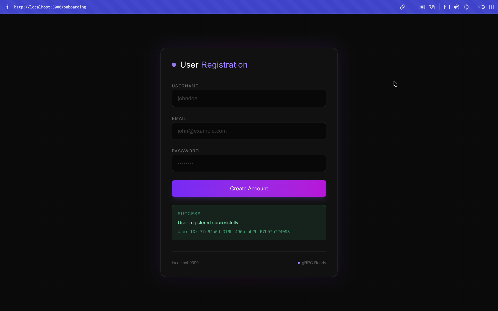
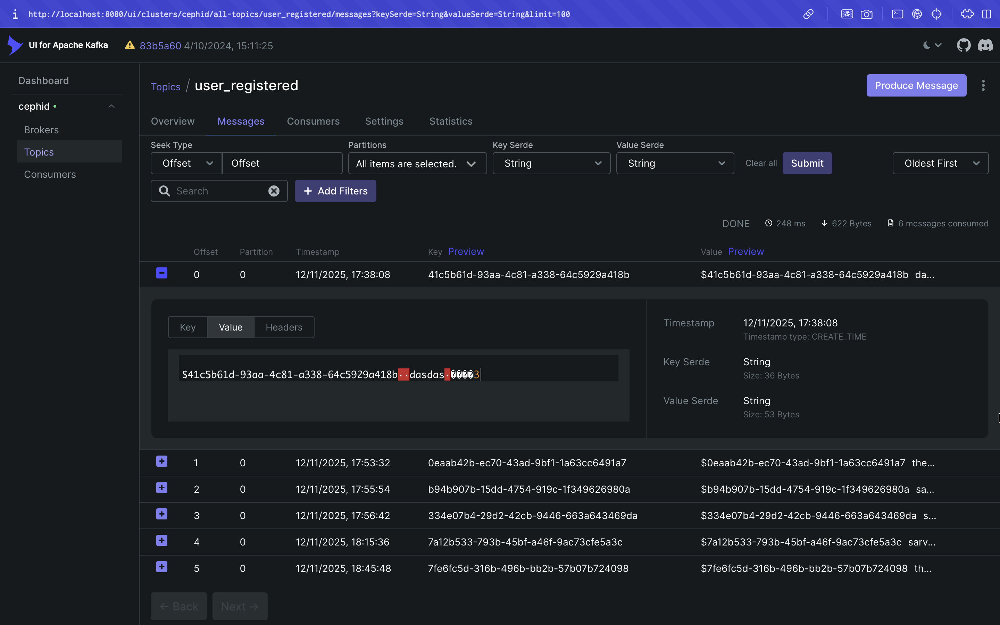
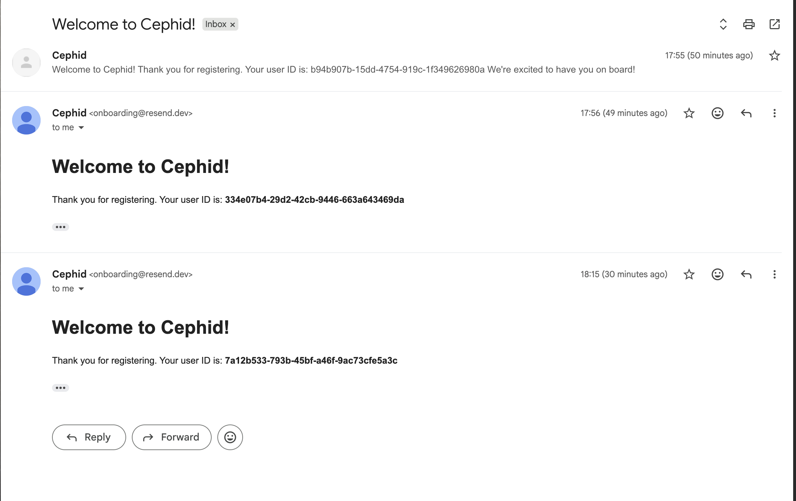

## cephid

A distributed user registration system with event-driven architecture.

### High-Level Overview


**Flow:**
1. **User Registration** – The user submits a registration form on the **Frontend (Next.js)**
2. **Server Action** – The browser invokes the `registerUser()` Server Action which returns a JSON response
3. **gRPC Communication** – The Next.js server communicates with the **Backend (Spring)** over a gRPC channel using binary protocol
4. **Event Publishing** – The backend produces a `user_registered` event to **Kafka**
5. **Event Consumption** – The **Notification Service (Go)** consumes messages from the Kafka topic
6. **Email Delivery** – The notification service sends a welcome email via **Resend**

### Demo

**Ping Test (gRPC health check):**



**Successful Registration:**



**Duplicate Email Validation:**


**Kafka UI – Events Published:**



**Welcome Email Received:**



### Ports

| Service | Port | URL |
|---------|------|-----|
| Frontend | 3000 | http://localhost:3000 |
| Backend (gRPC) | 9090 | localhost:9090 |
| Kafka (host) | 29094 | localhost:29094 |
| Kafka (internal) | 9094 | cephid-kafka:9094 |
| Kafka UI | 8080 | http://localhost:8080 |
| Notification Service | - | (Kafka consumer, no exposed port) |

### Environment Variables

| Variable | Service | Description |
|----------|---------|-------------|
| `RESEND_API_KEY` | notification-service | Resend API key for sending emails |

### Running

**Prerequisites:**
- Docker and Docker Compose installed
- Resend API key (get one at [resend.com](https://resend.com))

**1. Configure environment:**

Create `notification-service/.env` file:
```bash
RESEND_API_KEY=re_xxxxxxxxx
```

**2. Start all services:**

```bash
# Build and start all containers
docker-compose up --build
```

**3. Access the application:**

| Service | URL |
|---------|-----|
| Frontend | http://localhost:3000 |
| Kafka UI | http://localhost:8080 |

**Useful commands:**

```bash
# Start in detached mode
docker-compose up -d --build

# View logs
docker-compose logs -f

# View logs for specific service
docker-compose logs -f frontend
docker-compose logs -f backend
docker-compose logs -f notification-service

# Stop all services
docker-compose down

# Stop and remove volumes (clean slate)
docker-compose down -v
```
